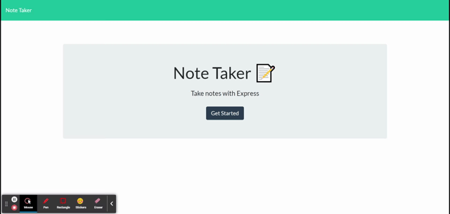

# Note_Taker

## Description
This application allows the user to take notes and save the note to the backend so the user can click on the saved note to access it again.

## Link to Application:
[Click to be taken to application](https://thawing-falls-53716.herokuapp.com/)

## Preview of Application:

## Table of Contents
* [Intallation](#installation)
* [License](#license)
* [Contributing](#contributing)
* [Questions](#questions)

## Installation
To install necessary dependencies, run the following command:
~~~
npm i
~~~

## License 
This project is licensed under the [The Unlicense](http://unlicense.org/) license.

## Contributing
When contributing to this repository, Fork the repo on GitHub, Clone the project to your machine, Commit changes to your own branch, Push your work back up to your fork, then Submit a pull request so your changes can be reviewed.

## Questions
If you have any questions about the repo, open an issue or contact me directly at brandon.l.maxwell@gmail.com. You can find more of my work at [brandon-maxwell](https://github.com/brandon-maxwell).
